# 绘制NBA球员投篮点图
很多篮球迷对NBA球员的习惯出手位置感兴趣，想要得到如下的这种图：

[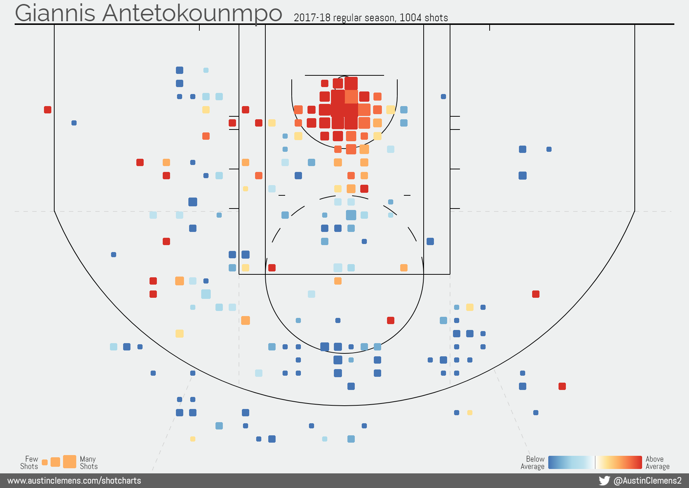](http://www.austinclemens.com/shotcharts/)

经搜索发现网上已有相关资源，基本都来源于[How to Create NBA Shot Charts in Python](http://savvastjortjoglou.com/nba-shot-sharts.html)，但是现在按照这些教程都不能重现。

本文将介绍怎样具体可操作的用python的matplotlib包实现绘制NBA球员投篮点图。

### 要做到这件事主要是解决两个大问题:

* NBA球员的投篮数据从哪里获得 (大多网上已有资源卡在了这里)
* 怎么样绘制到图表

### 我们将练习到如下知识:

* 怎么样通过网页分析获取数据API
* 获取网页数据的基础方式
* 绘制篮球半场图

# 第一部分--获取球员投篮位置数据
NBA官方并没有提供公共的API方便我们访问球员的shot log, [Web Scraping 201: finding the API](http://www.gregreda.com/2015/02/15/web-scraping-finding-the-api/)这篇文章为我们提供了分析网页寻找数据API的方法，我们要分析NBA球员shot log可拆解成以下步骤：

* 锁定目标网站(哪个网站有NBA球员shot log数据)
* 具体网页对象(具体哪个网页有shot log数据)
* 分析shot log API
* 通过API获取感兴趣球员的shot log数据

1. **锁定目标网站**

目标网站：[stats.nba.com](http://stats.nba.com)

2. **具体网页对象**

shot log所在的页面标签可能会有改变，有时不在很显眼的位置，这也是很多教程失效的原因(只给了最后API的网址，没有说这个网址是怎么来的)，所以这个得花时间找一下。

首先打开目标网站[stats.nba.com](http://stats.nba.com)，按下图所示依次点击`Player`，`See All Stats`

[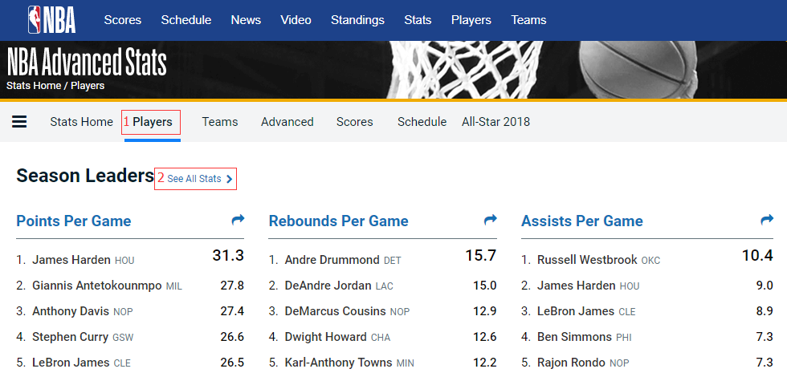](https://stats.nba.com)

按照图中1、2顺序点击后会得到以下页面

[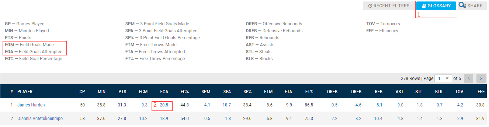](https://stats.nba.com/leaders/)

页面表格是每个NBA球员的数据，表头都是简写，通过图示点击`GLOSSARY`我们得到表头详细信息，其中`FGA-Field Goals Attempted`表示尝试投篮的位置，表格中每个球员的`FGA`列的数字都是可点击的，我们按上图所示点击`James Harden`的`FGA`列数字，跳转的结果是显示了`James Harden`2017-18常规赛的`Hex Hap`

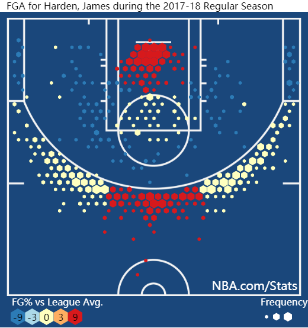

`Shot Plot`

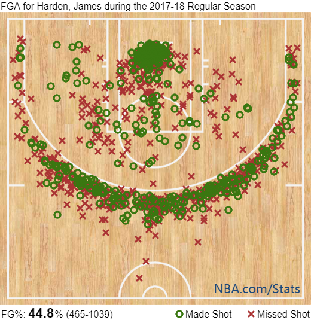

`Shot Zones`

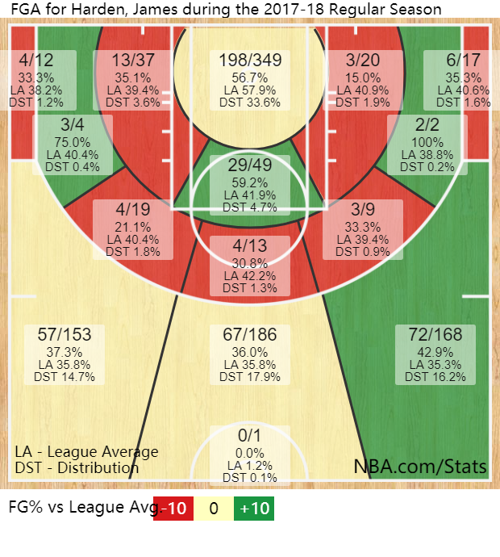

好了，可以结束了...

等等，我们的目的不是简单得到`Shot Plot`，而是要练习一些知识，所以，继续

点击`James Harden`的`FGA`数据，跳转后的页面除了以上3个图还包括以下这个表格

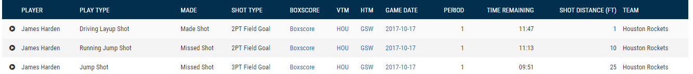

这个表格的内容结合`Shot Plot`的图，可以确定，要找的`具体网页对象`应该是这个页面了，但是表格中并没有直接给出投篮位置信息，这个网页访问的API应该包括这些信息，所以我们进入下面的步骤

3. **分析shot log API**

我们以Chrome浏览器为例，在上一步找到的`具体网页对象`页面打开浏览器的开发者选项(更多工具->开发者工具)，然后按F5键，刷新页面，你将得到如下页面

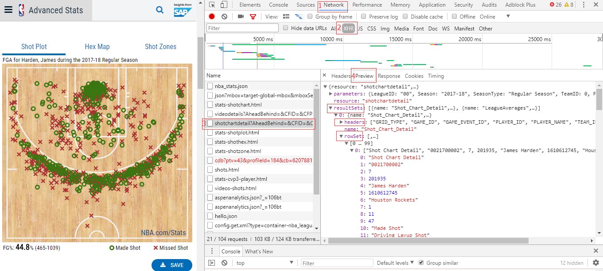

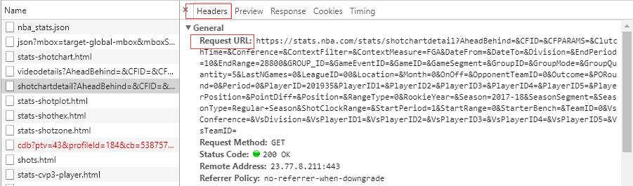

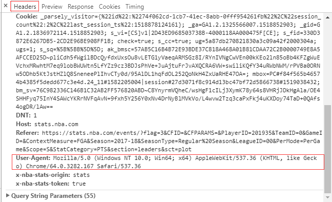

我们按上图红色数字标注，依次点击，选择`Network`，然后点击`XHR`进行过滤，`XHR`是[XMLHttpRequest](https://en.wikipedia.org/wiki/XMLHttpRequest)的简写 - 这是一种用来获取XML或JSON数据的请求类型。经`XHR`筛选后表格中的有几个条目，红色数字标注为3的既是我们将要查找的shot log API，`Preview`标签中包括：

* resource - 请求的名称 shotchartdetail。
* parameters - 请求参数，提交给API的请求参数，我们可以理解成SQL语言的条件语句，例如赛季、球员ID等等，我们改变URL中的参数就能得到不同的数据
* resultSets - 请求得到的数据集，包含两个表格。仔细看表头（headers）第一个表格包含我们想要的shot log信息（LOC_X，LOC_Y）。

与`Preview`并列的`Headers`标签包含：

* Request URL - API URL
* Requset Headers - 请的表头，用程序爬取网页请求数据时会用到

通过API获取感兴趣球员的shot log数据

4. **通过API获取感兴趣球员的shot log数据**

上一步得到了`James Harden`shot log的Request URL和Requset Headers，下面我们要做的是通过python代码获取shot log数据，以下是代码

```
	import requests
	import pandas as pd

	shot_chart_url = 'http://stats.nba.com/stats/shotchartdetail?AheadBehind=&'\
					 'CFID=&CFPARAMS=&ClutchTime=&Conference=&ContextFilter=&ContextMeasure=FGA'\
					 '&DateFrom=&DateTo=&Division=&EndPeriod=10&EndRange=28800&GROUP_ID=&GameEventID='\
					 '&GameID=&GameSegment=&GroupID=&GroupMode=&GroupQuantity=5&LastNGames=0&LeagueID=00'\
					 '&Location=&Month=0&OnOff=&OpponentTeamID=0&Outcome=&PORound=0&Period=0&PlayerID={PlayerID}'\
					 '&PlayerID1=&PlayerID2=&PlayerID3=&PlayerID4=&PlayerID5=&PlayerPosition=&PointDiff=&Position='\
					 '&RangeType=0&RookieYear=&Season={Season}&SeasonSegment=&SeasonType={SeasonType}'\
					 '&ShotClockRange=&StartPeriod=1&StartRange=0&StarterBench=&TeamID=0&VsConference='\
					 '&VsDivision=&VsPlayerID1=&VsPlayerID2=&VsPlayerID3=&VsPlayerID4=&VsPlayerID5='\
					 '&VsTeamID='.format(PlayerID=201935,Season='2017-18',SeasonType='Regular+Season')
	
	header = { 'User-Agent' : 'Mozilla/5.0 (Windows NT 6.1; Win64; x64) AppleWebKit/537.36 (KHTML, like Gecko)'\
							  ' Chrome/62.0.3202.94 Safari/537.36'}
	
	response = requests.get(shot_chart_url,headers=header)
	# headers是模拟浏览器访问行为，现在没有这一项获取不到数据

	headers = response.json()['resultSets'][0]['headers']
	shots = response.json()['resultSets'][0]['rowSet']
	shot_df = pd.DataFrame(shots, columns=headers)

	# View the head of the DataFrame and all its columns
	from IPython.display import display
	with pd.option_context('display.max_columns', None):
    	display(shot_df.head())
    # Or 
    #shot_df.head().to_excel('outfile.xls',index=True,header=True)
```

我们得到的pandas DataFrame:`shot_df`，表头及前3行数据展示如下：

|  | GRID_TYPE         | GAME_ID    | GAME_EVENT_ID | PLAYER_ID | PLAYER_NAME  | TEAM_ID    | TEAM_NAME       | PERIOD | MINUTES_REMAINING | SECONDS_REMAINING | EVENT_TYPE  | ACTION_TYPE        | SHOT_TYPE      | SHOT_ZONE_BASIC       | SHOT_ZONE_AREA | SHOT_ZONE_RANGE | SHOT_DISTANCE | LOC_X | LOC_Y | SHOT_ATTEMPTED_FLAG | SHOT_MADE_FLAG | GAME_DATE | HTM | VTM |
|---|-------------------|------------|---------------|-----------|--------------|------------|-----------------|--------|-------------------|-------------------|-------------|--------------------|----------------|-----------------------|----------------|-----------------|---------------|-------|-------|---------------------|----------------|-----------|-----|-----|
| 0 | Shot Chart Detail | 0021700002 | 7             | 201935    | James Harden | 1610612745 | Houston Rockets | 1      | 11                | 47                | Made Shot   | Driving Layup Shot | 2PT Field Goal | Restricted Area       | Center(C)      | Less Than 8 ft. | 1             | -10   | 16    | 1                   | 1              | 20171017  | GSW | HOU |
| 1 | Shot Chart Detail | 0021700002 | 10            | 201935    | James Harden | 1610612745 | Houston Rockets | 1      | 11                | 13                | Missed Shot | Running Jump Shot  | 2PT Field Goal | In The Paint (Non-RA) | Center(C)      | 8-16 ft.        | 10            | 46    | 94    | 1                   | 0              | 20171017  | GSW | HOU |
| 2 | Shot Chart Detail | 0021700002 | 28            | 201935    | James Harden | 1610612745 | Houston Rockets | 1      | 9                 | 51                | Missed Shot | Jump Shot          | 3PT Field Goal | Above the Break 3     | Center(C)      | 24+ ft.         | 25            | -52   | 245   | 1                   | 0              | 20171017  | GSW | HOU |

shot_chart_url其中PlayerID、Season、SeasonType三项是可变参数，如果想获得其他球员的PlayerID可以登录[nba.com/players](http://www.nba.com/players/)搜索感兴趣球员的名字，如下

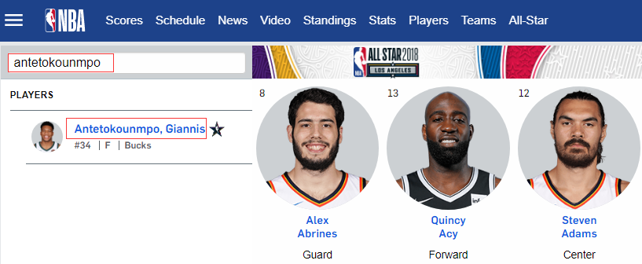

点击搜索结果，跳转到页面的网址最后一项既是PlayerID，例如：`http://www.nba.com/players/giannis/antetokounmpo/203507`中的`203507`即是字母哥的PlayerID。

我们这一步得到的`shot_df`包含了James Harden在2017-18赛季常规赛目前为止（20180219全明星赛）所有投篮尝试。我们需要的数据为`LOC_X`和`LOC_Y`两列，这些是每次投篮尝试的坐标值，然后可以将这些坐标值绘制到代表篮球场的坐标轴上，当然我们可能还需要`EVENT_TYPE`列，来区分投篮是否投进。

# 第二部分--绘制球员shot log到球场图

关于这一部分，[How to Create NBA Shot Charts in Python](http://savvastjortjoglou.com/nba-shot-sharts.html)已经做了非常优秀的工作，我们会延续其框架，并对代码做少许修改以达到更好的适用性。

首先我们对上一步得到的James Harden的shot log `LOC_X`和`LOC_Y`进行快速绘图，看其X、Y是怎么定义的。

```
import matplotlib.pyplot as plt

fig = plt.figure(figsize=(4.3,4))
ax = fig.add_subplot(111)
ax.scatter(shot_df.LOC_X, shot_df.LOC_Y)
plt.show()
```

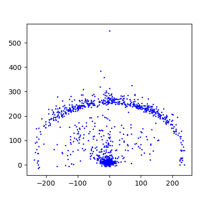

通过快速预览图我们对`LOC_X`和`LOC_Y`有了一个大概的认识，有一点需要注意：`LOC_X`其实是观众视野从中场面向篮筐来说的，`LOC_X`是正值则在篮筐的左边。所以最终绘图时需要按以下代码做调整，我们以shot log中Right Side(R) 投篮区域(投篮区域划分请参考前文`Shot Zones`图)的出手作为示例说明。

```
right_shot_df = shot_df[shot_df.SHOT_ZONE_AREA == "Right Side(R)"]
other_shot_df = shot_df[~(shot_df.SHOT_ZONE_AREA == "Right Side(R)")]

fig = plt.figure(figsize=(4.3,4))
ax = fig.add_subplot(111)
ax.scatter(right_shot_df.LOC_X, right_shot_df.LOC_Y, s=1, c='red', label='Right Side(R)')
ax.scatter(other_shot_df.LOC_X, other_shot_df.LOC_Y, s=1, c='blue', label='Other AREA')
ax.set_ylim(top=-50,bottom=580)
ax.legend()
plt.show()
```

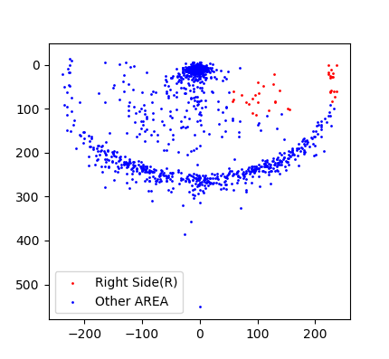

## 画篮球半场图

通过对`LOC_X`和`LOC_Y`数据的快速画图，我们大概知道了篮筐的位置大概就是`LOC_X`和`LOC_Y`的原点。知道了这一点，我们结合篮球半场的具体尺寸 ([下图](https://www.sportsknowhow.com/basketball/dimensions/nba-basketball-court-dimensions.html))和比例就可以画出篮球半场图了。

[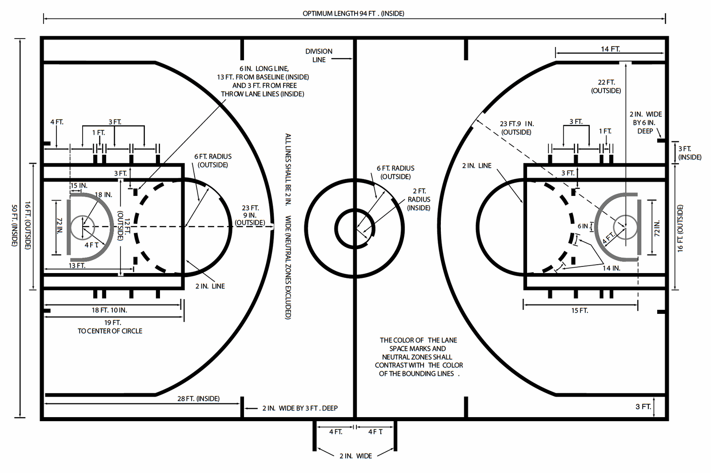](http://www.sportscourtdimensions.com/wp-content/uploads/2015/02/nba_court_dimensions_h.png)

通过上图我们知道了篮球场宽度是`50FT`，转换成`INCH`是`600IN`，篮球场长`94FT`，转换成`INCH`是`1128IN`，再结合我们上一步画出的投篮点快速预览图，我们能够推测出`LOC_X`和`LOC_Y`的计算单位是`IN`。


