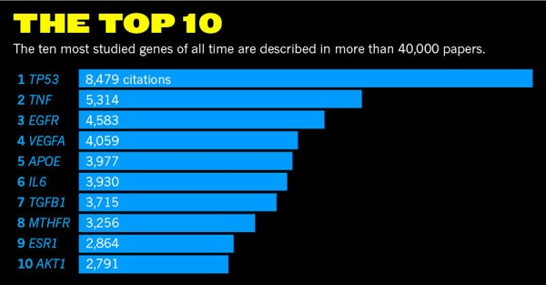
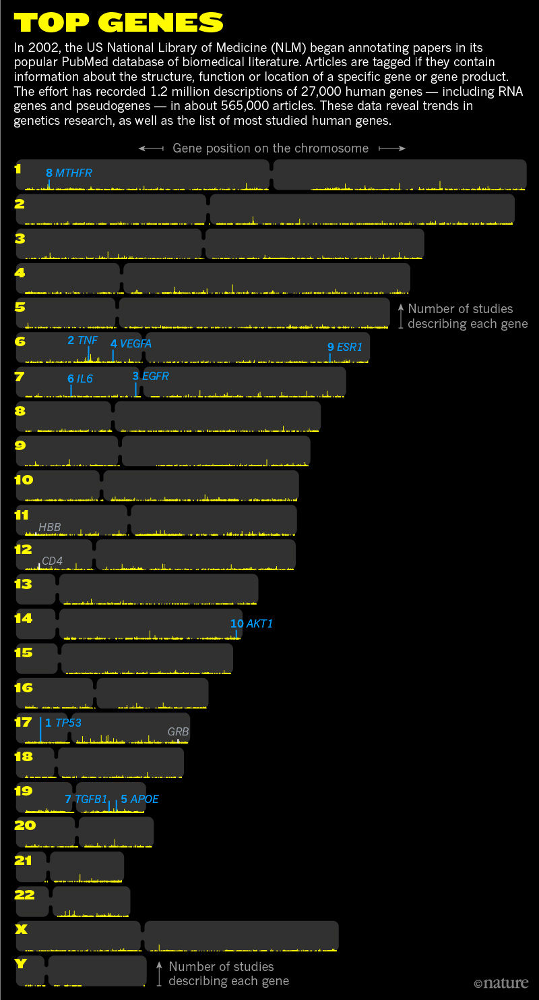
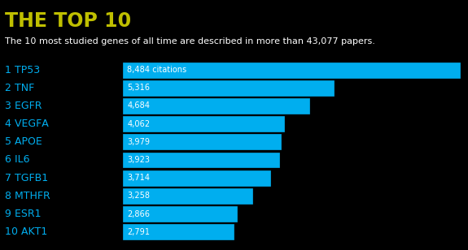
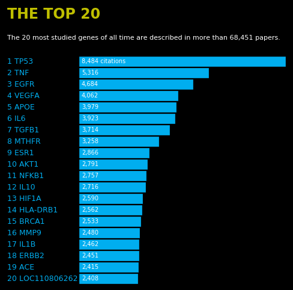
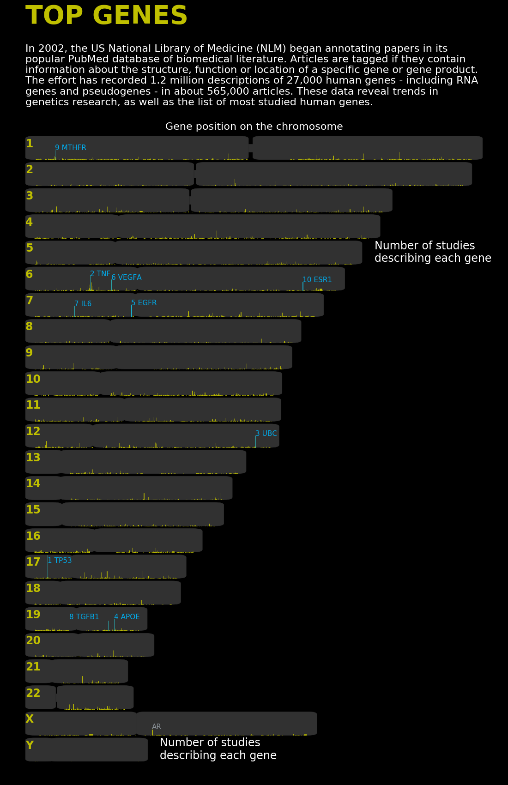
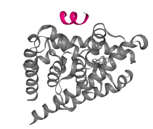

# 复现"The most popular genes in the human genome"

 从14年工作接触编程语言至今除早期入门阶段外很少记编程笔记，更多的是从已写过的程序里去找自己记得不是很清楚的东西。
 前几天看到一篇文章《NATURE》长文：The most popular genes in the human genome，除了对文章的内容有很大兴趣之外，对于文中的图的精美也很向往，为了做matplotlib画图demo, 记录一些常用画图设置模板，我打算重现文中的两张图。

### 重现的文章原图如下
 第一幅图是一个条形图,展示了被研究次数最多10个的基因
 第二幅图是一个所有基因研究次数图,并展示基因在染色体上的位置

 
 

### 下载的数据
 * 顺藤摸瓜，找到做这个github：https://github.com/pkerpedjiev/gene-citation-counts
 * 发现人基因组所有基因被研究次数的文件https://github.com/pkerpedjiev/gene-citation-counts/all_gene_counts.tsv果断下载
 * 要重现第二幅图还需要基因组大小文件以及着丝粒在基因组上的位置信息，所以需要下载http://hgdownload.cse.ucsc.edu/goldenpath/hg19/database/chromInfo.txt.gz，http://hgdownload.cse.ucsc.edu/goldenPath/hg19/database/cytoBand.txt.gz
 * 在作者github这个项目的Issues里发现有人提了一个问题：你做的都是被研究最多gene的分析，尝试做一下NcRNA会有更有意思的东西发现吧。作者果断甩出一个文件链接gene_info_然后total_human.tsv，回答说所有的基因组元件citations信息都在这里，你感兴趣自己玩去吧。然后我果断下载之，发现文件中被研究最多的基因按照研究次数进行了排序，所以这个文件就作为了我重现第一幅图的数据源。ps：为一个1个Issues已经被作者删除。 
 
### 第一幅图被重现，使用方法如下

`python3 The_Most_Studied_Genes.py -i gene_info_total_human.tsv -n 20`

### 第一幅效果如下
 
 

### 第二幅图照虎画猫

 输入参数就固定写了，程序和数据（all_gene_counts.tsv）放同一目录下，直接执行就会出结果

`python3 gene_on_chrom.py` 

### 第二幅效果如下

 
 通过与原图的对比我发现和文章结果是一些出入的，在top10基因的排名上，有些不同，也许作者两组数据的产生时间稍有不同。如果想彻底问清楚可以一步步重现作者的搜集数据步骤，自己做数据搜集工作

### 发现
  
 X染色体上被研究最多的一个基因为AR(Androgen receptor),蛋白结构如下：
 
 

 在基因组上的位置

 

### 源代码

 点击阅读原文查看
 https://github.com/seqyuan/programs/tree/master/plot/The_Most_Studied_Genes
