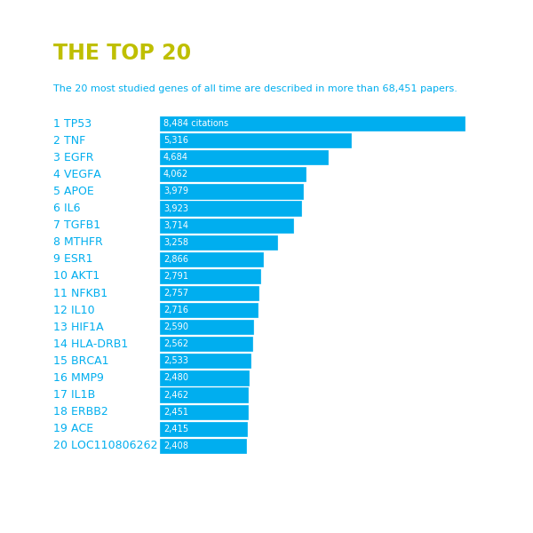

# 复现"The most popular genes in the human genome"

 为了做matplotlib画图笔记,记录一些常用画图设置模板

 下载了The most popular genes in the human genome (doi: 10.1038/d41586-017-07291-9)

 的统计数据,复现了其中两幅图

## 条形图--被研究最多次数的基因

### 下载的数据 

* gene_info_total_human.tsv

 包含所有基因组元件被研究次数信息,一篇研究文章算一次

### 使用方法

`python3 The_Most_Studied_Genes.py -i gene_info_total_human.tsv -n 20`

### 结果示例
 

## 基因在染色体位置图--包含基因所有被研究次数

### 下载的数据 

* all_gene_counts.tsv

 只包含基因的研究信息,包含基因上的在染色体位置信息

* http://hgdownload.cse.ucsc.edu/goldenpath/hg19/database/chromInfo.txt.gz

 人类基因组各染色体大小文件
  
* http://hgdownload.cse.ucsc.edu/goldenPath/hg19/database/cytoBand.txt.gz
 
 包含着丝粒在染色体上的位置信息 

### 使用方法

`python3 The_Most_Studied_Genes.py -i gene_info_total_human.tsv -n 20`

### 结果示例
 
