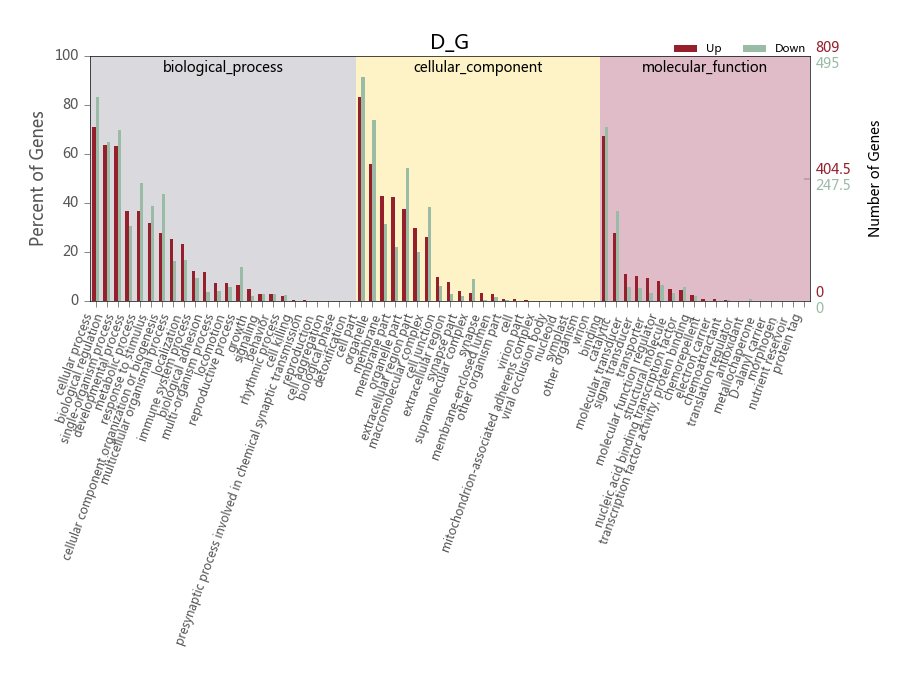
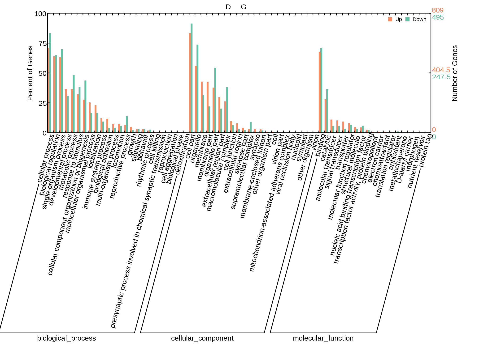

### 使用方法

`python3 UpDownGenes_GoEnrichment.py -f  D_G_Up_Down.txt -s title -o ./`

### 输入文件格式

| GO Term            | GO Subterm       | Up_Count | Up_Percent  | Down_Count | Down_Percent |
|--------------------|------------------|----------|-------------|------------|--------------|
| biological_process | cellular process | 575      | 0.710754017 | 412        | 0.832323232  |
| cellular_component | cell part        | 673      | 0.831891224 | 452        | 0.913131313  |
| molecular_function | binding          | 546      | 0.674907293 | 351        | 0.709090909  |

### 结果示例
 

### 常见图示例
 