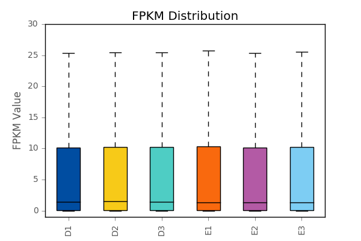

# 使用方法
`python3 fpkm_distribution_box.py fpkm.xls fpkm.boxplot.pdf 'FPKM Distribution' 'FPKM Value'`
# 输入文件格式
  name | D1	| D2 |	D3	| E1 |	E2 |	E3 
  :-------- | :--------|:--------|:--------|:--------|:--------|:--------
 gene027601	| 10.47	| 10.66	| 10.93 |	10.46	| 9.99 |	11.56 
 gene034858	| 2.45	| 2.45	| 2.32	| 1.85	| 1.85	| 1.5|
 gene013593	| 119.11 |	116.56	| 114.39 |	76.34 |	77.96	| 78.1 

# 结果示例
 