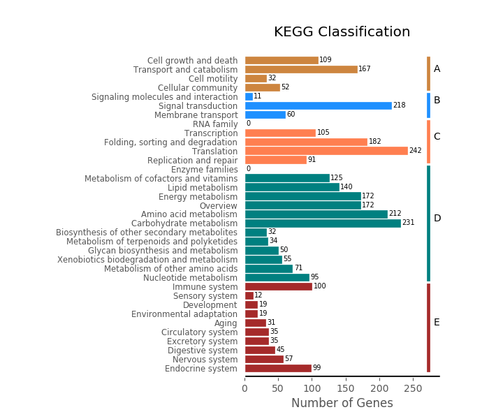
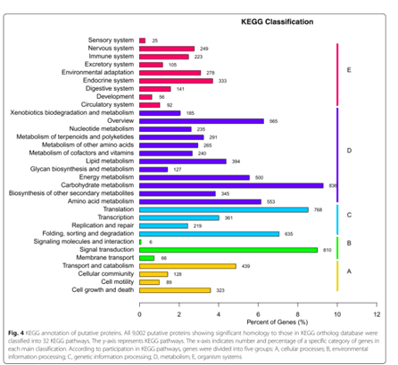

## 功能
### 读入KEGG claffification文件,输出条形图

## 输入文件示例

Group | Classification | Value
----|------|----
Cell growth and death | A  | 109
Transport and catabolism | A  | 167
Cell motility | A  | 32

## 用法
`python3 kegg_classification.py -c class.txt`

`python3 kegg_classification.py -c class.txt -s case_vs_control -o ./`

## 输出文件示例
 

## 文献类似的图
 
